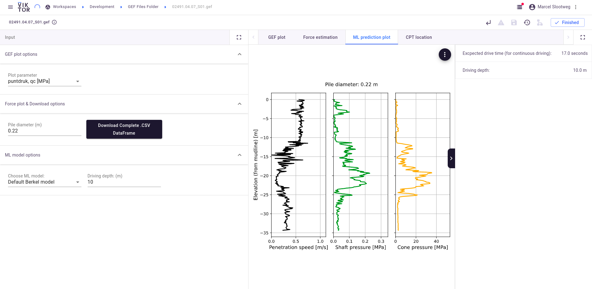

# Sample ML Pile driving

This App shows an implementation of a Machine learning model in a VIKTOR App. 


The Sample ML Pile driving app was developed during the exploration phase of
[Voorbij Funderingtechniek](https://www.voorbijfunderingstechniek.nl/)'s search for the implementation of 
Machine Learning in their field of expertise. This has resulted in an app that could train and predict the pile drive 
speed using a cone penetration test (CPT) as only input.

This app only presents the part of the app with which a user can make pile drive speed predictions by uploading a
CPT file (.GEF).

# App structure: 
```
GEFFolder: 
  └─ GEF: created upon upload of a GEF

```

# How to use the app
After installing (for installation steps, refer to the section [Installation](#installation)) and starting up the app, follow
these steps:

### Step 1:
Click on the GEF Files Folder. Here you will find all the GEF files that have been uploaded already.
### Step 2:
Upload a GEF file. This can be done by clicking on the button "Create new object", and uploading a GEF file. 
A sample GEF file can be found in `app/gef/gef_files` for testing purposes, or one could go to 
[BROloket](https://www.broloket.nl/ondergrondgegevens) to request CPTs for a specified region.
### Step 3:
Define the pile diameter, and select the ML model and the depth to be estimated.
### Step 4:
Check out the results.



## Installation

### Step 1:
Install the application using the `viktor-cli install` command. For more info refer to the [VIKTOR documentation](https://docs.viktor.ai/docs/cli#install)
### Step 2:
The Tensorflow package can exceed the available memory during installation, which is the reason why is was excluded from
the requirements. Use the following command:

```
./viktor-cli run viktor-test --max-memory 2000 -- pip install tensorflow==2.5.0 -t /usr/src/packages --upgrade
```
